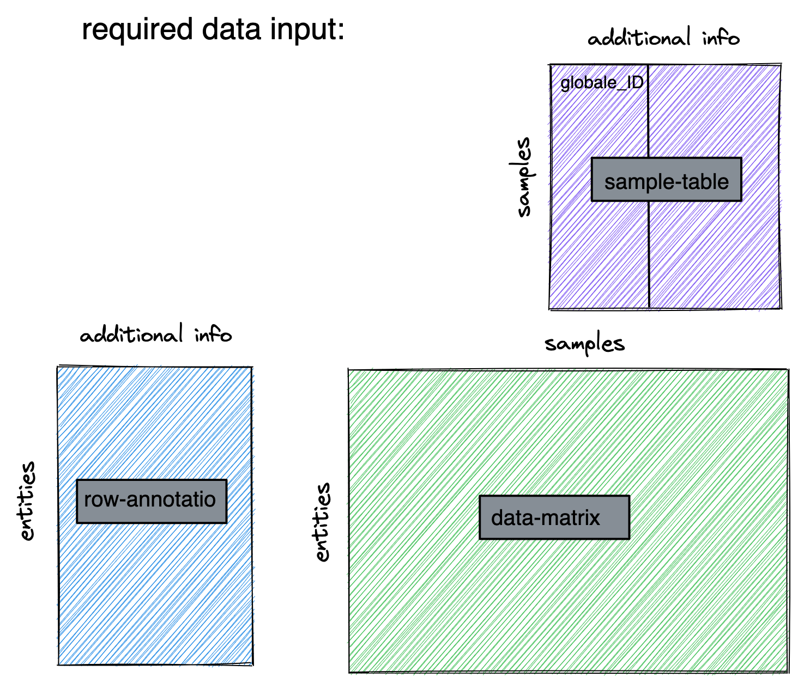

## Working with shinyOmics
`Hello and Welcome to shinyOmics!`

> In the follwoing the genereal workflow of the app will be showcased. 
> This is intendend to help you in the start, but of course you can use whatever
> options you believe are best suited!  
> Currently we have mutliple omics types one can analyse, each of which requires
> a specified workflow. Hence the following sections are focussing on each omic-type
> individually. 
> **This is work in process and about to grow** 
> *Please do not hesitate to contact me lea.seep@uni-bonn.de in case of questions
> or further needed functionalities!*

#### Input Data Structure - Requirements
You need 3 tables to start with, the MUST have the following structure:  
1. data-matrix (.csv)  
  - contains the actual data, e.g. counts 
  - must have the samples (e.g. mouse 1) in the columns and the *unique* naming as column name 
  - must have the entities (e.g. genes) in the rows and a *unique* rowname (e.g. ENSEMBL ID) 
2. sample-table (.csv)  
  - contains metadata about each sample (e.g. disease status) (To come: combination with the Metadata sheet) 
  - must have the *same* naming as in data-matrix (1.colnames) in the rownames 
  - must have at least one column names `global_ID`, this will be used to refer to the sample (in e.g. Volcano plot) (in future not necassary anymore) 
3. row-annotation (.csv)  
  - contains metadata about the biological entities (e.g. if gene is protein coding) 
  - must have the *same* naming as in data-matrix (1.rownames) in the rownames 
  - if you do not have any information just add a column with the gene-names 
  
Maybe a picture helps for understanding: 

  
#### General Notes 
At the moment this app is mainly there to help you to visualize your data and start an explorative search for it. Therefore it offers single-omics analysis including: 
- Simple Pre-processing (different options) 
- PCA as dimension reduction method, with the option to look into the driving variables of the components 
- Heatmaps to show and cluster the provided data, with differing selection options 
- KEGG and GO enrichment Analysis with the option to overlay enriched KEGG pathways with the found enriched genes and their FC of chosen conditions 

Depending on your sample-table and row-annotation (and the columns within), this information can be utilised to subset your data or to color it according to the differen annotations provided.

You see your options always on the left sidebar - those settings apply to the entire tab (e.g Tab Data selection or Enrichment Analysis). There might be sub-tab specific settings which are then displayed directly in the main window.
Also note that everything above the line beneath the "Do [whatever]"-button, needs a click on the respective button to be triggered. The remainder below the button triggers a reaction upon change (Hence for rather big plots (longer loadings), you should careful select the optopn as EVERY change triggers a replotting).

#### Transcriptomics:
##### TL;DR
- assuming bulk-RNA-Seq hence read in raw counts 
- select protein-coding genes (needs the appropiate annotation within the row-annotation-file) (potentially + HighIQR option to filter down to variable and high expressing genes) 
- general processing is always done which means every gene which has less or it equal to 10 counts is removed
- do DE-Seq preprocessing and choose the variable which contrasts (mostly like treatment) you are interested in (check if still appropriate when previously high filtering) 
- do you visualizes  

#### Metabolomics:
##### TL;DR
- internal normalized data (e.g. quantified data relying on internal standards) 
- select all entities you are interested in (based on provided row annotatio ) 
- general processing is always done which means here evere entitie with a row median of 0 will be removed
- do your visualization  

